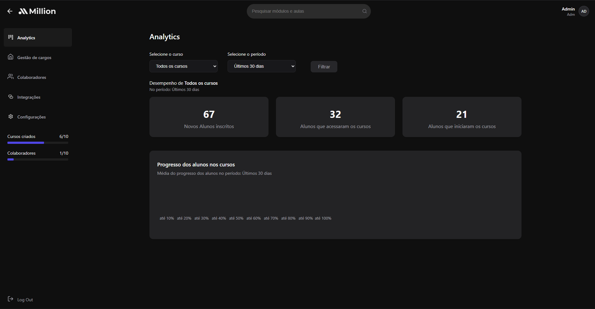

# Dashboard de videos

Dashboard de aulas no formato area de membros, criado para organizar e distribuir cursos em video.



## Objetivo do projeto

O Dashboard de videos foi pensado para cobrir os dois lados de uma plataforma de cursos:

- Criacao de um dashboard do zero para administrar conteudos.
- Alocacao e organizacao de videos por curso/modulo.
- Experiencia do aluno para acessar, navegar e consumir aulas em uma area de membros.

Em resumo, o app permite estruturar os cursos para quem gerencia e entregar uma experiencia simples para quem assiste.

## Funcionalidades principais

- Painel para montar o dashboard de cursos e aulas.
- Estrutura para vincular videos aos cursos.
- Area de login/acesso de membros.
- Visualizacao dos conteudos pelos alunos em um fluxo de consumo.

## Como rodar localmente

```bash
npm install
ng serve
```

A aplicacao roda em `http://localhost:4200/`.

## Build

```bash
ng build
```

Os arquivos de build sao gerados em `dist/`.

## Testes

```bash
ng test
```
